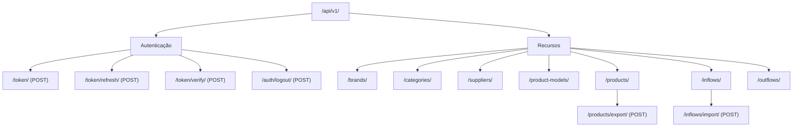
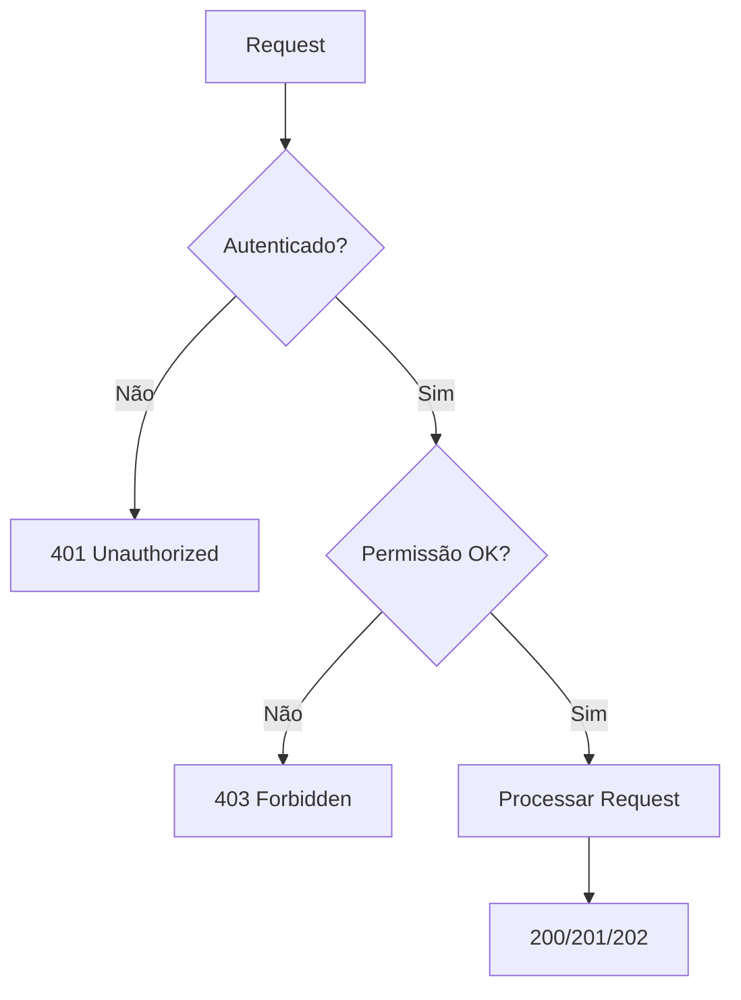

# Referência de API

Esta página documenta todos os endpoints REST da API, incluindo autenticação, permissões e exemplos de request/response.

---

## 🌐 Base URL

- **Desenvolvimento**: `http://localhost:8000/api/v1/`
- **Produção**: `https://yourdomain.com/api/v1/`

---

## 📚 Documentação Interativa

| Ferramenta | URL | Descrição |
| **Swagger UI** | `/api/v1/docs/` | Interface interativa para testar endpoints |
| **ReDoc** | `/api/v1/redoc/` | Documentação limpa e navegável |
| **Schema OpenAPI** | `/api/v1/schema/` | Especificação OpenAPI 3.0 (JSON) |

---

## 🗺️ Mapa de Endpoints



---

## 🔐 Autenticação JWT

### 1. Obter Token (Login)

**Endpoint**: `POST /api/v1/token/`

```json
// Request
{
  "username": "admin",
  "password": "senha123"
}

// Response
{
  "refresh": "eyJhbGciOiJIUzI1NiIsInR5cCI6...",
  "access": "eyJhbGciOiJIUzI1NiIsInR5cCI6..."
}
```

### 2. Usar Token

Adicione o token em **todas as requisições**:

```http
GET /api/v1/products/
Authorization: Bearer <access_token>
```

### 3. Refresh Token

**Endpoint**: `POST /api/v1/token/refresh/`

```json
// Request
{
  "refresh": "eyJhbGciOiJIUzI1NiIsInR5cCI6..."
}

// Response
{
  "access": "eyJhbGciOiJIUzI1NiIsInR5cCI6..."
}
```

### 4. Logout (Blacklist)

**Endpoint**: `POST /api/v1/auth/logout/`

```json
// Request
{
  "refresh": "eyJhbGciOiJIUzI1NiIsInR5cCI6..."
}

// Response
{
  "detail": "Token adicionado à blacklist com sucesso."
}
```

---

## 📋 Recursos Principais

### Products (Produtos)

| Método | Endpoint | Ação | Permissão |
| GET | `/products/` | Listar produtos | Autenticado |
| POST | `/products/` | Criar produto | IsStaff |
| GET | `/products/{id}/` | Detalhar produto | Autenticado |
| PUT/PATCH | `/products/{id}/` | Atualizar produto | IsStaff |
| DELETE | `/products/{id}/` | Deletar produto | IsAdmin |
| **POST** | `/products/export/` | **Exportar dados** | Autenticado |

#### Exemplo: Listar Produtos

```http
GET /api/v1/products/?page=1&page_size=10

// Response
{
  "count": 50,
  "next": "http://localhost:8000/api/v1/products/?page=2",
  "previous": null,
  "results": [
    {
      "id": 1,
      "title": "Notebook Dell Inspiron",
      "serial_number": "SN-00001",
      "cost_price": "2500.00",
      "sell_price": "3200.00",
      "quantity": 15,
      "product_model": {
        "id": 1,
        "name": "Inspiron 15 3000"
      },
      "category": {
        "id": 1,
        "name": "Eletrônicos"
      }
    }
  ]
}
```

#### Exemplo: Exportar Produtos

```http
POST /api/v1/products/export/
Content-Type: application/json

{
  "file_format": "csv"  // csv, json, xml, pdf
}

// Response (202 Accepted)
{
  "message": "Export iniciado",
  "task_id": "abc123-def456",
  "notification_id": 42
}
```

---

### Inflows (Entradas)

| Método | Endpoint | Ação | Permissão |
| GET | `/inflows/` | Listar entradas | Autenticado |
| POST | `/inflows/` | Registrar entrada | IsStaff |
| GET | `/inflows/{id}/` | Detalhar entrada | Autenticado |
| **POST** | `/inflows/import/` | **Importar dados CSV** | IsStaff |

#### Exemplo: Registrar Entrada

```http
POST /api/v1/inflows/
Content-Type: application/json

{
  "supplier": 5,
  "product": 10,
  "quantity": 50,
  "description": "NF 12345/2025"
}

// Response (201 Created)
{
  "id": 123,
  "supplier": {
    "id": 5,
    "name": "FornecedorX"
  },
  "product": {
    "id": 10,
    "title": "Mouse Gamer",
    "quantity": 100  // Atualizado automaticamente
  },
  "quantity": 50,
  "description": "NF 12345/2025",
  "created_at": "2026-01-28T22:00:00Z"
}
```

---

## ⚠️ Códigos de Status HTTP

| Código | Significado | Quando Ocorre |
| **200** | OK | Requisição bem-sucedida |
| **201** | Created | Recurso criado com sucesso |
| **202** | Accepted | Tarefa assíncrona iniciada |
| **400** | Bad Request | Dados inválidos no request |
| **401** | Unauthorized | Token ausente ou inválido |
| **403** | Forbidden | Usuário sem permissão |
| **404** | Not Found | Recurso não encontrado |
| **500** | Server Error | Erro interno do servidor |

---

## 🔒 Permissões por Endpoint



### Níveis de Acesso

1. **AllowAny**: Sem autenticação (apenas `/token/`)
2. **IsAuthenticated**: Qualquer usuário autenticado
3. **IsStaff**: Usuários com `is_staff=True`
4. **IsAdminUser**: Usuários com `is_superuser=True`

---

## 📦 Payload Padrão de Erro

```json
{
  "detail": "Authentication credentials were not provided."
}

// Ou para erros de validação:
{
  "field_name": [
    "Este campo é obrigatório."
  ]
}
```

---

## 🔍 Filtros e Busca

### Query Parameters

```http
GET /api/v1/products/?search=notebook&ordering=-created_at&category=1
```

| Parâmetro | Tipo | Descrição |
| `search` | String | Busca por título ou serial_number |
| `ordering` | String | Campo para ordenação (- para DESC) |
| `category` | Integer | Filtrar por categoria |
| `page` | Integer | Número da página |
| `page_size` | Integer | Itens por página (max: 100) |

---

## 🚀 Rate Limiting (Throttling)

- **Usuário autenticado**: 1000 requests/hora
- **Anônimo**: 100 requests/hora

Se exceder:

```json
{
  "detail": "Request was throttled. Expected available in 3600 seconds."
}
```
