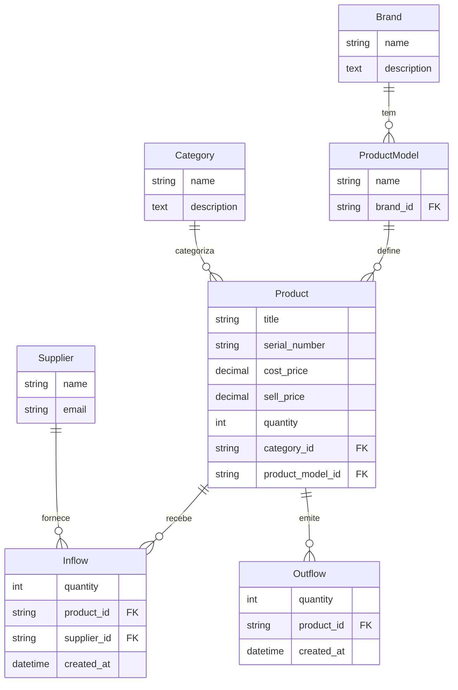

# Guia de Arquitetura

Este documento fornece uma visão geral técnica do Sistema de Gestão de Estoque.

## 🏗️ Visão Geral do Sistema

O sistema é construído como um monólito modular utilizando **Django**, com foco em robustez, escalabilidade e facilidade de manutenção. A comunicação externa é realizada através de uma **API REST** documentada, enquanto tarefas assíncronas são gerenciadas por filas de mensagens.

### Stack Tecnológica Principal

- **Framework Web**: Django 6.0
- **API**: Django Rest Framework (DRF)
- **Banco de Dados**: PostgreSQL 17
- **Cache & Mensageria**: Redis
- **Processamento Assíncrono**: Celery + Flower
- **Servidor de Aplicação**: Gunicorn + Uvicorn
- **Proxy Reverso**: Nginx
- **Monitoramento**: Sentry

## 🧩 Modelo de Dados

O núcleo do sistema gira em torno do gerenciamento de produtos e suas movimentações (entradas e saídas). Abaixo está o diagrama de Entidade-Relacionamento simplificado:



### Principais Entidades

1. **Product (Produto)**: Entidade central. Mantém o estado atual do estoque (`quantity`), preços e metadados.
2. **Inflow (Entrada)**: Registra o aumento de estoque. Vincula um produto a um fornecedor (`Supplier`).
3. **Outflow (Saída)**: Registra a baixa de estoque. Representa vendas ou retiradas.
4. **Auxiliares**: `Brand` (Marca), `Category` (Categoria) e `ProductModel` (Modelo) servem para classificar e organizar os produtos.

## ⚙️ Infraestrutura e Deploy

A infraestrutura é totalmente conteinerizada usando Docker, garantindo paridade entre desenvolvimento e produção.

```mermaid
graph TD
    User[Usuário / Cliente] -->|HTTP/HTTPS| Nginx[Nginx Proxy]
    Nginx -->|Proxy Pass| Web[Django App (Gunicorn/Uvicorn)]

    subgraph Services
        Web -->|Lê/Escreve| DB[(PostgreSQL)]
        Web -->|Cache/Filas| Redis[(Redis)]

        Worker[Celery Worker] -->|Consome Tarefas| Redis
        Worker -->|Persiste Dados| DB

        Flower[Flower Dashboard] -->|Monitora| Redis
    end
```

### Serviços

- **inventory_web**: Container principal da aplicação Django.
- **inventory_worker**: Processa tarefas em background (ex: relatórios pesados, envio de emails).
- **inventory_db**: Banco de dados relacional persistente.
- **inventory_redis**: Broker para o Celery e backend de cache para o Django.
- **inventory_nginx**: Servidor web que serve arquivos estáticos e faz proxy para a aplicação.

## 🔐 Segurança e Autenticação

- **Autenticação**: Baseada em **JWT (JSON Web Tokens)** via `rest_framework_simplejwt`.
- **Permissões**: Controle de acesso baseado em cargos (Role-Based Access Control) nativo do Django (`add_product`, `view_product`, etc.).
- **Variáveis de Ambiente**: Segredos (chaves de API, senhas de DB) são gerenciados via `.env` e nunca commitados no código.

## 📏 Padrões de Código

- **Linting**: Ruff é utilizado para garantir estilo e qualidade de código (PEP 8).
- **Tipagem**: MyPy é usado para verificação estática de tipos.
- **Testes**: Pytest é o framework de testes, com cobertura monitorada via `pytest-cov`.
- **Pre-commit**: Hooks garantem que nada seja commitado sem passar pelos padrões de qualidade.
