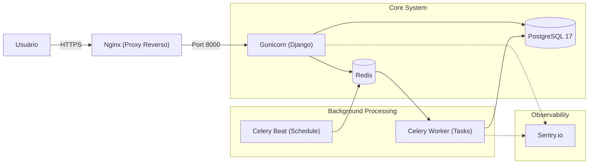
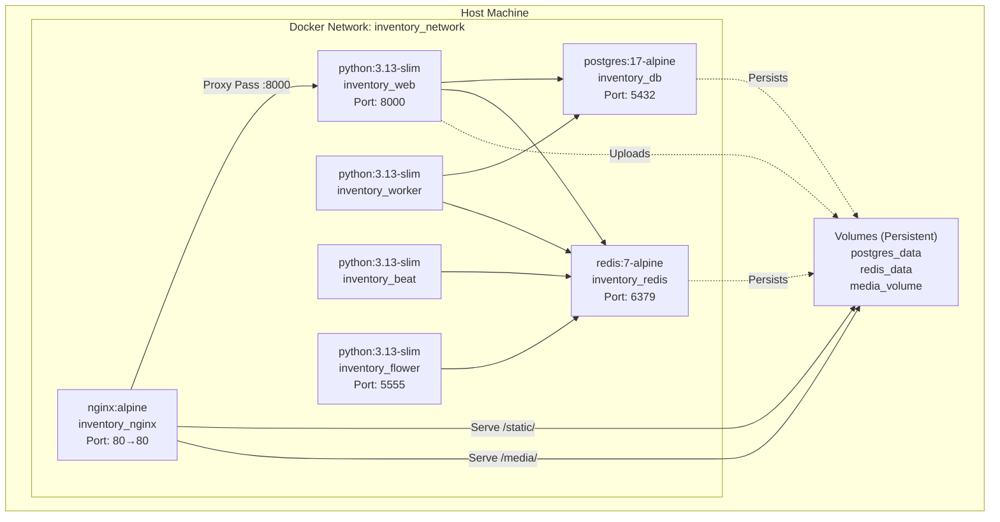
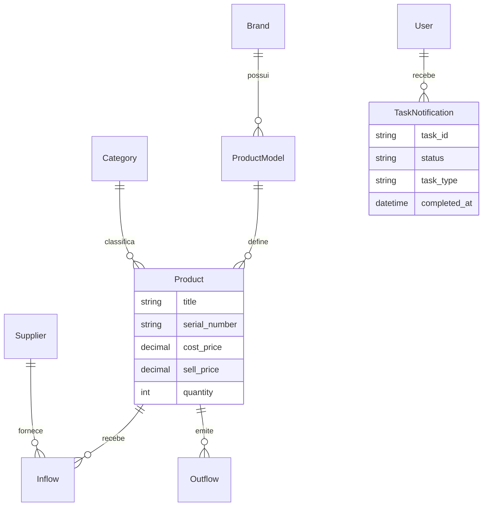
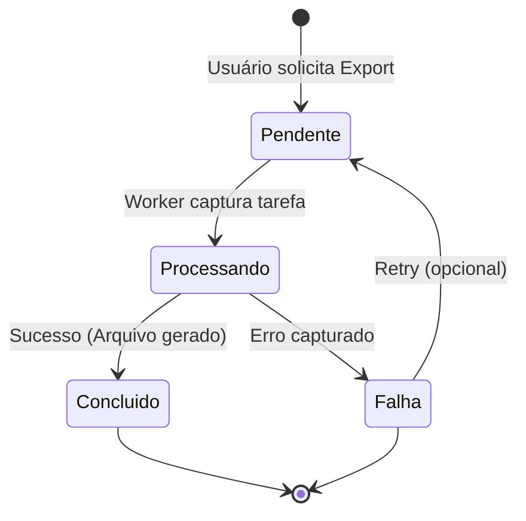
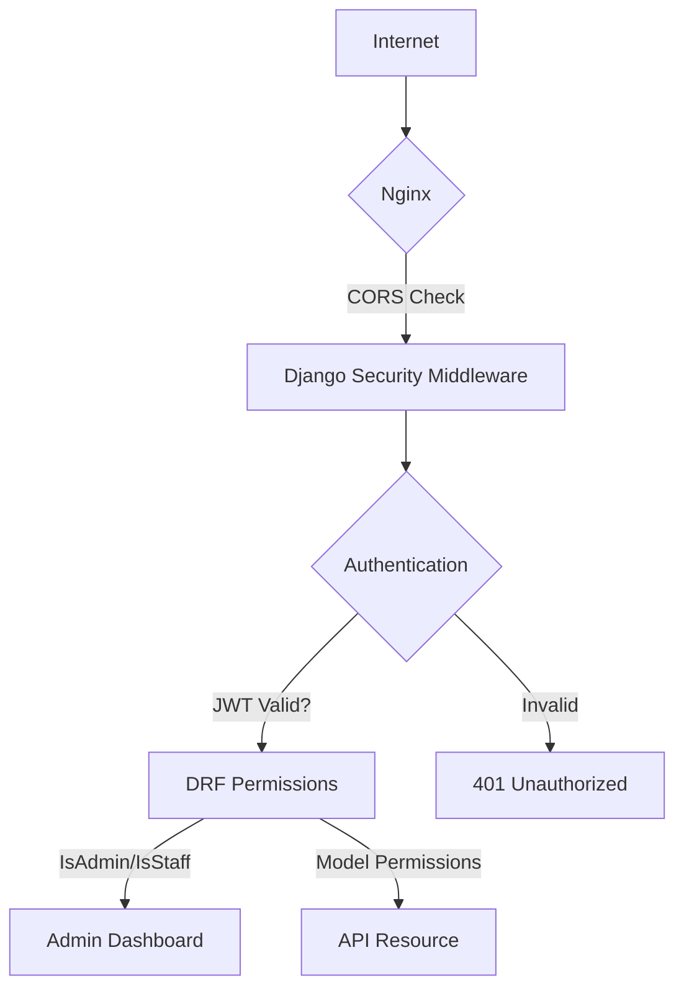
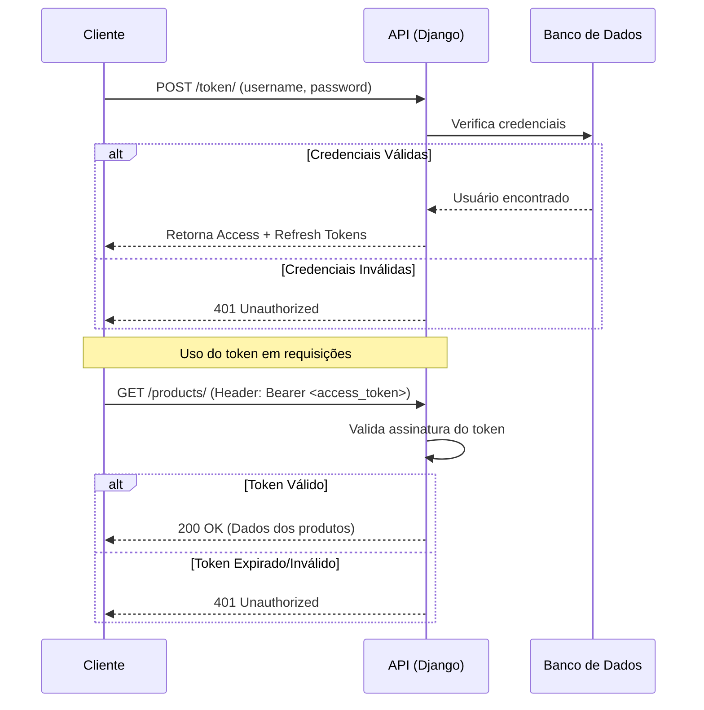

# Guia de Arquitetura

Este documento fornece um aprofundamento técnico sobre a infraestrutura e o fluxo de dados do sistema.

## 🏗️ Topologia da Infraestrutura

O sistema utiliza uma arquitetura de serviços coordenados via Docker Compose, garantindo isolamento e escalabilidade horizontal para os workers.



## 🐳 Componentes Docker

O sistema roda em containers isolados que se comunicam via rede interna.



### Health Checks

Cada serviço possui verificações de saúde:

```yaml
# docker-compose.yml
healthcheck:
  test: ["CMD", "curl", "-f", "http://localhost:8000/health/"]
  interval: 30s
  timeout: 10s
  retries: 3
  start_period: 40s
```

## 📊 Modelo de Dados (ERD)

A estrutura do banco de dados é projetada para integridade referencial total.



## 🔄 Lifecycle de Tarefas Assíncronas

As tarefas de exportação/importação seguem um fluxo de estados gerenciado pelo Celery e rastreado no banco de dados.



## ⚙️ Componentes de Infraestrutura

### Nginx (Proxy Reverso)

O Nginx atua como a primeira camada de defesa e otimização:

- **Proxy Pass**: Encaminha requisições dinâmicas para o Gunicorn.
- **Static Serving**: Serve diretamente os arquivos em `/staticfiles/` sem onerar o Django.
- **Media Serving**: Gerencia o download de arquivos protegidos em `/mediafiles/` (como exports gerados).
- **Docs Hosting**: Serve esta documentação estática (MKDocs) em `/docs/`.

### Celery & Redis

- **Broker**: O Redis armazena a fila de mensagens.
- **Worker**: Processa tarefas `shared_task` (exports, imports).
- **Beat**: Um agendador que dispara tarefas periódicas (ex: `update_dashboard_metrics_cache` a cada 5 minutos).
- **Result Backend**: Utilizamos `django-db` para persistir o histórico de resultados das tarefas, permitindo que o usuário veja o status em "Notificações".

### Monitoramento com Sentry

Configurado em `app/settings.py`, o Sentry captura:

- Exceções não tratadas (500 errors).
- Gargalos de performance em queries SQL.
- Erros em tarefas assíncronas do Celery.

---

## 🔐 Camadas de Segurança



### Fluxo de Autenticação (JWT)

O sistema utiliza `rest_framework_simplejwt`:

1. **Login**: O cliente envia credenciais e recebe `access` e `refresh` tokens.
2. **Access Token**: Curta duração (30 min), enviado no header `Authorization: Bearer <token>`.
3. **Refresh Token**: Longa duração (7 dias), usado para obter um novo `access` sem re-autenticar.
4. **Blacklist**: Ao deslogar (logout), o token é colocado em uma blacklist no banco de dados.



## 📊 Estratégia de Caching

Para garantir que o dashboard seja carregado em milissegundos, utilizamos cache agressivo no Redis:

- **Métricas Globais**: Armazenadas como chaves JSON `metrics:product`, `metrics:sales`, etc.
- **Invalidação**: O cache é renovado pelo Celery Beat ou via signals em alterações críticas.
