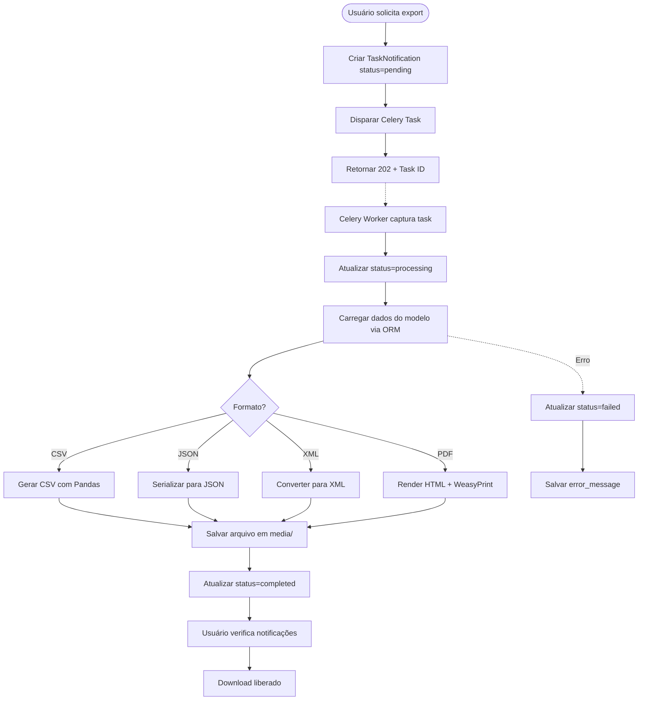
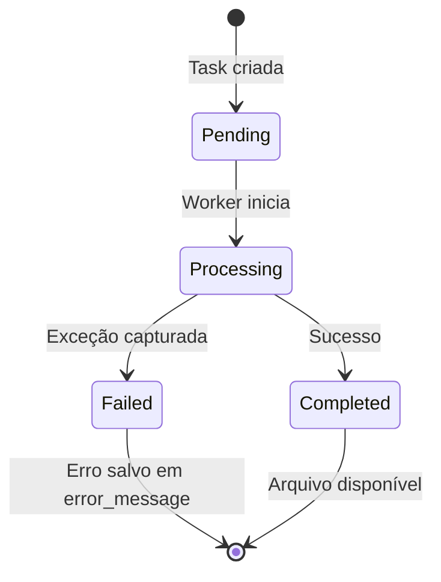
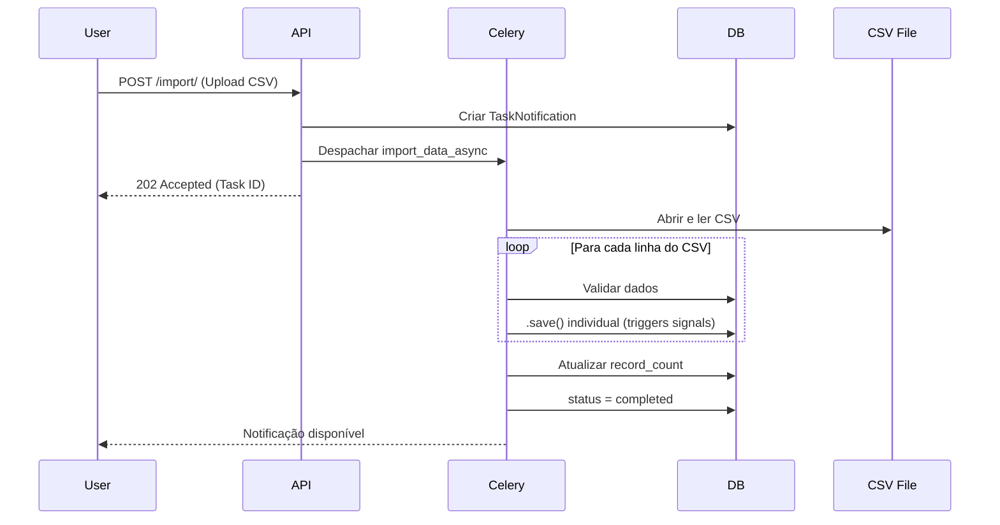

# Tarefas Assíncronas (Celery)

Esta página documenta o sistema de processamento em background usando Celery, incluindo todas as tasks, fluxos e estratégias de retry.

---

## 📊 Visão Geral das Tasks

O sistema possui **3 tasks principais** rodando via Celery:

| Task | Tipo | Trigger | Descrição |
| `export_data_async` | On-demand | API Call | Exportação de dados para CSV/PDF/JSON/XML |
| `import_data_async` | On-demand | API Call | Importação de dados via arquivo CSV |
| `update_dashboard_metrics_cache` | Periódica | Celery Beat (5min) | Atualização de cache de métricas |

---

## 🔄 Task 1: Export Data (Assíncrono)

**Nome**: `app.tasks.export_data_async`  
**Propósito**: Gerar relatórios pesados sem travar a interface do usuário.

### Fluxo de Execução



### Parâmetros de Entrada

- **`notification_id`**: ID da notificação criada previamente
  - Se `None`, busca pelo `task_id` do Celery

### Formatos Suportados

```python
# CSV: DataFrame exportado via Pandas
queryset → DataFrame → CSV

# JSON: Serialização nativa do Django
queryset → model_to_dict → JSON

# XML: Conversão manual
queryset → dict → XML string

# PDF: Template HTML renderizado
queryset → Template → HTML → WeasyPrint → PDF
```

### Tratamento de Erros



---

## 📥 Task 2: Import Data (Assíncrono)

**Nome**: `app.tasks.import_data_async`  
**Propósito**: Processar grandes volumes de dados sem bloquear a aplicação.

### Fluxo de Execução



### Validações e Mapeamento

O sistema utiliza o **`DataImportService`** que:

1. Lê o CSV usando `pandas.read_csv()`
2. Converte campos conforme o mapeamento do modelo
3. Chama `.save()` individual (não bulk) para disparar signals
4. Registra erros linha a linha

### Por que `.save()` individual?

```python
# ❌ ERRADO: bulk_create ignora signals
Product.objects.bulk_create([...])

# ✅ CORRETO: save() individual dispara signals de estoque
for row in data:
    product.save()  # Atualiza quantity via signal
```

---

## 📊 Task 3: Dashboard Metrics Cache

**Nome**: `app.tasks.update_dashboard_metrics_cache`  
**Propósito**: Pré-calcular métricas pesadas a cada 5 minutos.

### Métricas Atualizadas

| Chave Redis | Função | Descrição |
| `metrics:product` | `get_product_metrics_raw()` | Total produtos, valor em estoque |
| `metrics:sales` | `get_sales_metrics_raw()` | Vendas totais, faturamento |
| `metrics:daily_sales` | `get_daily_sales_data_raw()` | Vendas por dia (últimos 30 dias) |
| `metrics:daily_sales_quantity` | `get_daily_sales_quantity_data_raw()` | Quantidade vendida por dia |
| `metrics:products_by_category` | `get_products_by_category_raw()` | Distribuição por categoria |
| `metrics:products_by_brand` | `get_products_by_brand_raw()` | Distribuição por marca |

### Configuração Celery Beat

```python
# app/celery.py
app.conf.beat_schedule = {
    'update-dashboard-metrics': {
        'task': 'app.tasks.update_dashboard_metrics_cache',
        'schedule': crontab(minute='*/5'),  # A cada 5 minutos
    },
}
```

### Cache TTL (Time To Live)

```python
cache_ttl = 60 * 10  # 10 minutos
# 2x o intervalo do beat para evitar cache miss
```

---

## ⚙️ Configuração e Retry Strategy

### Retry Automático

Todas as tasks usam o retry padrão do Celery:

```python
@shared_task(bind=True, max_retries=3, default_retry_delay=60)
def export_data_async(self, notification_id):
    try:
        # ...
    except Exception as exc:
        raise self.retry(exc=exc)
```

### Monitoramento com Flower

- **URL**: `http://localhost:5555` (dev) ou porta configurada
- **Dashboard**: Visualização de tasks ativas, failed, succeeded
- **Logs**: Traceback de erros em tempo real

---

## 🔍 Debugging e Logs

### Ver logs do Worker

```bash
# Dev
docker-compose logs -f inventory_worker

# Prod
docker-compose -f docker-compose.prod.yml logs -f inventory_worker
```

### Verificar status de uma task

```python
from celery.result import AsyncResult
result = AsyncResult(task_id)
print(result.state)  # PENDING, STARTED, SUCCESS, FAILURE
```

### Limpar tarefas antigas

```bash
# Shell Django
python manage.py shell
>>> from notifications.models import TaskNotification
>>> TaskNotification.objects.filter(status='completed', is_read=True).delete()
```
