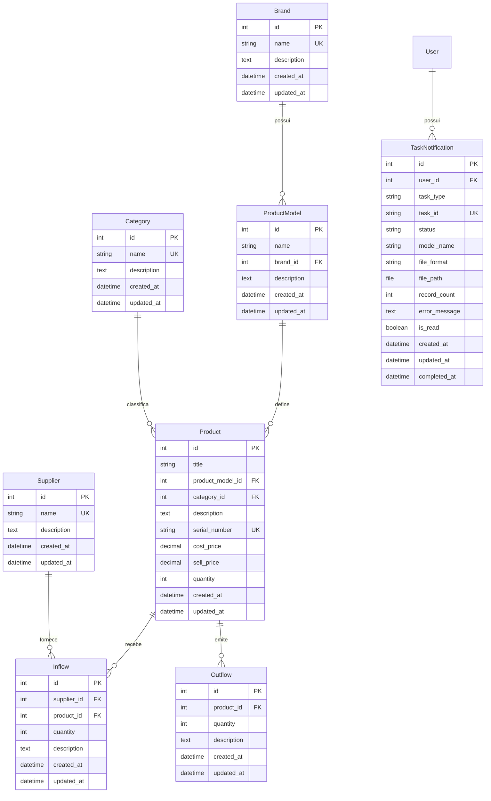

# Modelo de Dados

Esta página documenta a estrutura completa do banco de dados, incluindo todos os modelos, relacionamentos e constraints.

---

## 🗺️ Diagrama Entidade-Relacionamento Completo

---

## 📋 Documentação Detalhada dos Modelos

### Brand (Marca)

**App**: `brands`  
**Propósito**: Armazena fabricantes ou marcas próprias de produtos.

| Campo | Tipo | Constraints | Descrição |
| `id` | Integer | PK, Auto | Identificador único |
| `name` | Char(100) | NOT NULL | Nome da marca |
| `description` | Text | Nullable | Descrição adicional |
| `created_at` | DateTime | Auto | Data de criação |
| `updated_at` | DateTime | Auto | Última atualização |

**Meta**:

- Ordenação: `name` (alfabético)
- Índices: Padrão no PK

---

### Category (Categoria)

**App**: `categories`  
**Propósito**: Classificação lógica de produtos (ex: Eletrônicos, Alimentos).

| Campo | Tipo | Constraints | Descrição |
| `id` | Integer | PK, Auto | Identificador único |
| `name` | Char(100) | NOT NULL | Nome da categoria |
| `description` | Text | Nullable | Descrição adicional |
| `created_at` | DateTime | Auto | Data de criação |
| `updated_at` | DateTime | Auto | Última atualização |

**Meta**:

- Ordenação: `name` (alfabético)

---

### Supplier (Fornecedor)

**App**: `suppliers`  
**Propósito**: Cadastro de fornecedores de mercadorias.

| Campo | Tipo | Constraints | Descrição |
| `id` | Integer | PK, Auto | Identificador único |
| `name` | Char(100) | NOT NULL | Nome do fornecedor |
| `description` | Text | Nullable | Observações |
| `created_at` | DateTime | Auto | Data de criação |
| `updated_at` | DateTime | Auto | Última atualização |

**Meta**:

- Ordenação: `name` (alfabético)

---

### ProductModel (Modelo de Produto)

**App**: `product_models`  
**Propósito**: Definição técnica que agrupa variações de um mesmo tipo de produto.

| Campo | Tipo | Constraints | Descrição |
| `id` | Integer | PK, Auto | Identificador único |
| `name` | Char(100) | NOT NULL | Nome do modelo |
| `brand_id` | Integer | FK → Brand, CASCADE | Marca associada |
| `description` | Text | NOT NULL | Especificações técnicas |
| `created_at` | DateTime | Auto | Data de criação |
| `updated_at` | DateTime | Auto | Última atualização |

**Meta**:

- Ordenação: `name` (alfabético)
- Relacionamento: `brand.productmodel_set` (reverso)

---

### Product (Produto)

**App**: `products`  
**Propósito**: SKU final para venda ou controle de estoque.

| Campo | Tipo | Constraints | Descrição |
| `id` | Integer | PK, Auto | Identificador único |
| `title` | Char(500) | NOT NULL | Nome comercial |
| `product_model_id` | Integer | FK → ProductModel, PROTECT | Modelo técnico |
| `category_id` | Integer | FK → Category, PROTECT | Categoria |
| `description` | Text(1000) | | Descrição detalhada |
| `serial_number` | Char(100) | | Número de série/código |
| `cost_price` | Decimal(10,2) | | Preço de custo |
| `sell_price` | Decimal(10,2) | | Preço de venda sugerido |
| `quantity` | Integer | Default=0 | Saldo em estoque |
| `created_at` | DateTime | Auto | Data de criação |
| `updated_at` | DateTime | Auto | Última atualização |

**Meta**:

- Ordenação: `title` (alfabético)
- Relacionamentos: `inflows`, `outflows`

> **IMPORTANTE**: O campo `quantity` é atualizado automaticamente via **signals** ao registrar `Inflow` ou `Outflow`.

---

### Inflow (Entrada)

**App**: `inflows`  
**Propósito**: Registro de reposição de estoque.

| Campo | Tipo | Constraints | Descrição |
| `id` | Integer | PK, Auto | Identificador único |
| `supplier_id` | Integer | FK → Supplier, PROTECT | Fornecedor |
| `product_id` | Integer | FK → Product, PROTECT | Produto recebido |
| `quantity` | Integer | Positive | Quantidade recebida |
| `description` | Text | Nullable | Notas fiscais/observações |
| `created_at` | DateTime | Auto | Data de criação |
| `updated_at` | DateTime | Auto | Última atualização |

**Meta**:

- Ordenação: `-created_at` (mais recente primeiro)

---

### Outflow (Saída)

**App**: `outflows`  
**Propósito**: Registro de vendas/baixas no inventário.

| Campo | Tipo | Constraints | Descrição |
| `id` | Integer | PK, Auto | Identificador único |
| `product_id` | Integer | FK → Product, PROTECT | Produto vendido |
| `quantity` | Integer | Positive | Quantidade vendida |
| `description` | Text | Nullable | Observações |
| `created_at` | DateTime | Auto | Data de criação |
| `updated_at` | DateTime | Auto | Última atualização |

**Meta**:

- Ordenação: `-created_at` (mais recente primeiro)

---

### TaskNotification (Notificação de Tarefa)

**App**: `notifications`  
**Propósito**: Rastreamento de tarefas assíncronas (Celery).

| Campo | Tipo | Constraints | Descrição |
| `id` | Integer | PK, Auto | Identificador único |
| `user_id` | Integer | FK → User, CASCADE | Usuário responsável |
| `task_type` | Char(10) | Choices | `export` ou `import` |
| `task_id` | Char(255) | UNIQUE | ID da tarefa Celery |
| `status` | Char(20) | Choices | `pending`, `processing`, `completed`, `failed` |
| `model_name` | Char(100) | | Nome do modelo exportado |
| `file_format` | Char(10) | | Formato (CSV, PDF, JSON, XML) |
| `file_path` | FileField | Nullable | Caminho do arquivo gerado |
| `record_count` | Integer | Nullable | Total de registros processados |
| `error_message` | Text | | Mensagem de erro (se houver) |
| `is_read` | Boolean | Default=False | Status de leitura |
| `created_at` | DateTime | Auto | Data de criação |
| `updated_at` | DateTime | Auto | Última atualização |
| `completed_at` | DateTime | Nullable | Data de conclusão |

**Meta**:

- Ordenação: `-created_at` (mais recente primeiro)
- Índices: `(user, is_read)`, `task_id`

---

## 🔗 Regras de Integridade Referencial

| Relacionamento | Tipo | On Delete |
| ProductModel → Brand | Many-to-One | CASCADE |
| Product → ProductModel | Many-to-One | PROTECT |
| Product → Category | Many-to-One | PROTECT |
| Inflow → Supplier | Many-to-One | PROTECT |
| Inflow → Product | Many-to-One | PROTECT |
| Outflow → Product | Many-to-One | PROTECT |
| TaskNotification → User | Many-to-One | CASCADE |

> **PROTECT**: Impede a exclusão se houverem dependências.  
> **CASCADE**: Exclui em cascata os registros dependentes.
