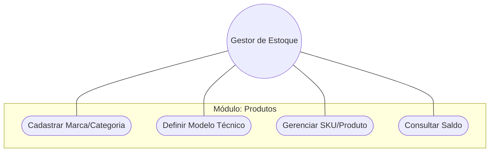
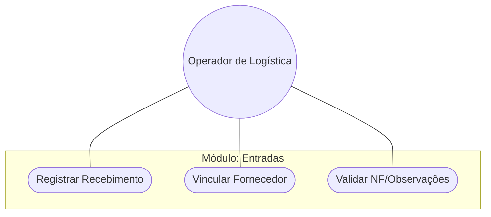
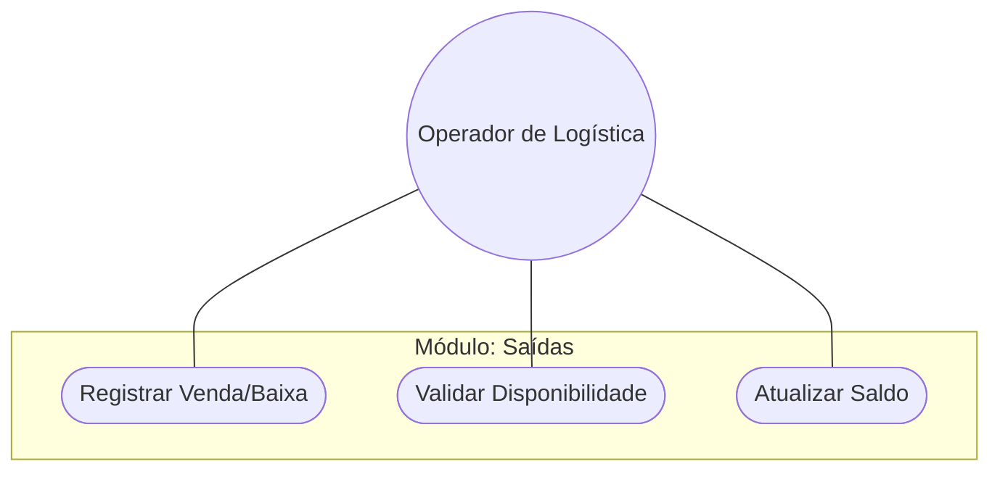
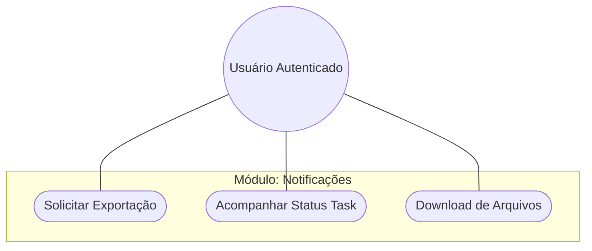
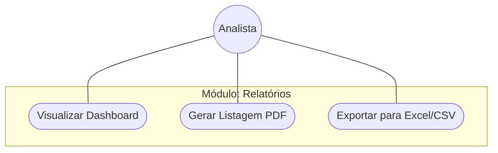

# Funcionalidades do Sistema

Esta página detalha as capacidades técnicas e operacionais de cada módulo do sistema, acompanhadas de seus respectivos diagramas de uso.

---

## 📦 Gestão de Produtos

**Resumo**: Este módulo é o coração do sistema, permitindo o cadastro e organização de itens de estoque com suporte a hierarquia de marcas, categorias e modelos.

---

## 📥 Entradas (Inflows)

**Resumo**: Gerencia a reposição de estoque. Cada entrada registra a quantidade recebida, o fornecedor responsável e atualiza o saldo do produto automaticamente.

---

## 📤 Saídas (Outflows)

**Resumo**: Controla a baixa de mercadorias. O sistema valida se há saldo suficiente antes de confirmar a saída, garantindo a integridade do inventário.

---

## 🔔 Notificações e Tarefas Assíncronas

**Resumo**: Gerencia processos pesados em background (Celery). O usuário solicita uma operação e é notificado quando o resultado está pronto.

---

## 📊 Relatórios Dinâmicos

**Resumo**: Transforma dados brutos em inteligência de negócio através de dashboards em tempo real e exportações formatadas.

