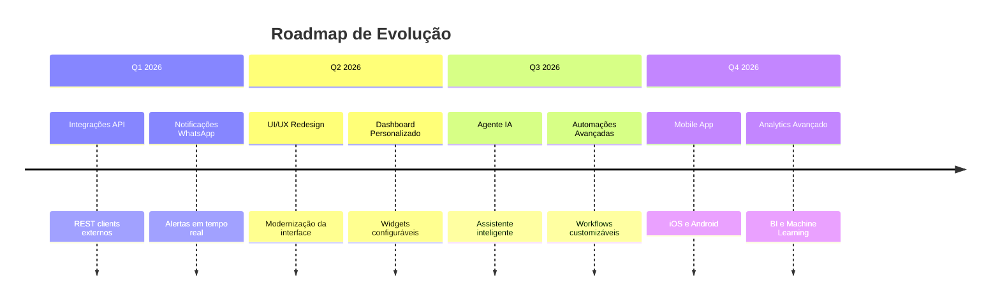
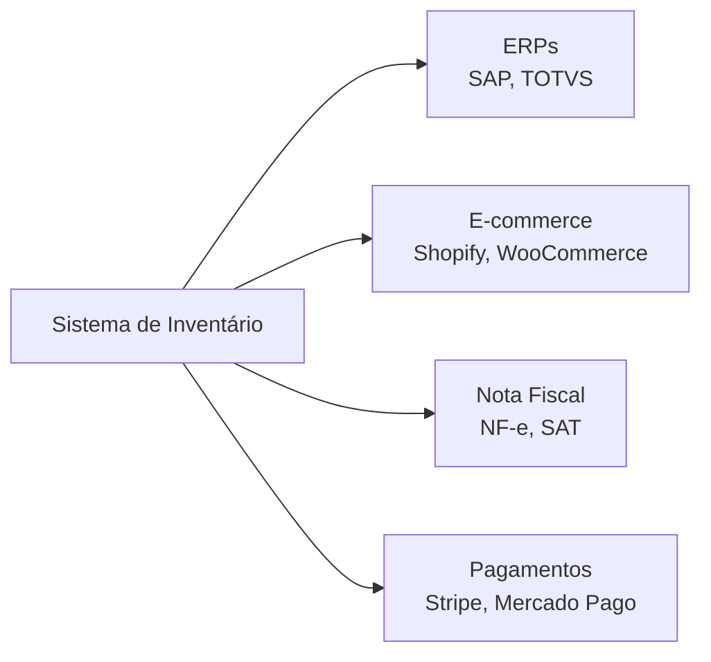
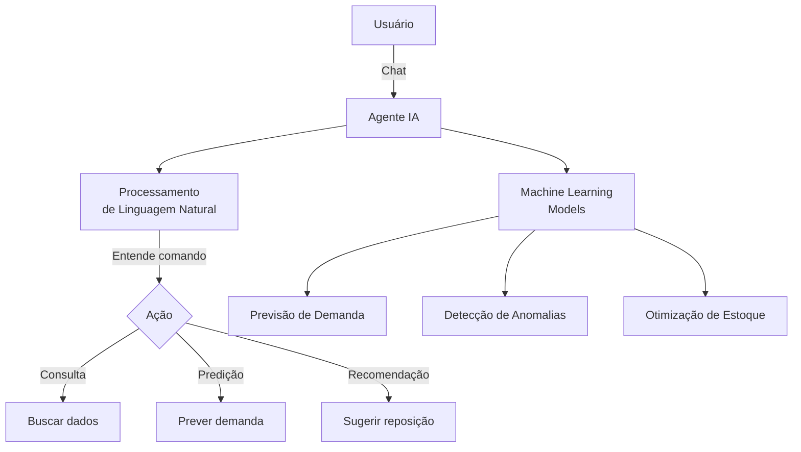

# Roadmap

Esta página apresenta a visão estratégica e os planos de evolução do sistema de gestão de inventário.

---

## 🗺️ Visão Geral



---

## 📋 Fases de Desenvolvimento

### 🔌 Fase 1: Integrações (Q2 2026)

**Status**: 🟡 Planejado

#### 1.1 APIs Externas



**Integrações Planejadas**:

- [ ] **ERPs**: Sincronização bidirecional (SAP, TOTVS, Protheus)
- [ ] **E-commerce**: Shopify, WooCommerce, Magento
- [ ] **Nota Fiscal**: Emissão automática NF-e/NFC-e
- [ ] **Gateways de Pagamento**: Stripe, Mercado Pago, PagSeguro

#### 1.2 Notificações WhatsApp

**Funcionalidades**:

- Alertas de estoque baixo
- Confirmação de entradas/saídas
- Relatórios diários por WhatsApp
- Chatbot para consultas rápidas

**Stack Técnica**:

- Twilio API ou WhatsApp Business API
- Webhooks para mensagens bidirecionais
- Templates pré-aprovados pelo WhatsApp

#### 1.3 Notificações por E-mail

**Automações**:

- Relatórios agendados (diário, semanal, mensal)
- Alertas de produtos com validade próxima
- Resumo de movimentações
- Notificações de tarefas assíncronas concluídas

**Stack Técnica**:

- SendGrid ou Amazon SES
- Templates HTML responsivos
- Sistema de filas com Celery

---

### 🎨 Fase 2: UI/UX (Q1 2026)

**Status**: 🟡 Planejado

**Objetivos**:

- Redesign completo da interface com framework moderno (React/Vue.js)
- Sistema de design unificado (design tokens)
- Modo escuro/claro
- Acessibilidade WCAG 2.1 AA

**Entregáveis**:

- [ ] Protótipos Figma de todas as telas
- [ ] Sistema de design documentado
- [ ] Frontend SPA com framework moderno
- [ ] Responsividade mobile-first

---

### 📊 Fase 3: Dashboard Personalizado (Q1 2026)

**Status**: 🟡 Planejado

**Objetivos**:

- Widgets drag-and-drop
- Painéis salvos por usuário
- Gráficos interativos (D3.js/Chart.js)
- Exportação de dashboards em PDF

**Widgets Planejados**:

1. **Indicadores de Estoque**
   - Produtos em baixa
   - Valor total em estoque
   - Top 10 movimentações

2. **Análise Financeira**
   - Faturamento mensal
   - Margem de lucro
   - Projeções de vendas

3. **Operacional**
   - Tempo médio de reposição
   - Taxa de rotatividade (turnover)
   - Sazonalidade de vendas

---

### 🤖 Fase 4: Agente de IA (Q3 2026)

**Status**: 🔵 Conceitual

**Visão**: Assistente inteligente para gestão preditiva de inventário.



**Capacidades**:

1. **Assistente Virtual**

   - "Qual o estoque de notebooks?"
   - "Quando devo repor o produto X?"
   - "Mostre as vendas desta semana"

2. **Predição de Demanda**

   - Análise de séries temporais (ARIMA, Prophet)
   - Previsão de vendas com ML
   - Sugestões automáticas de reposição

3. **Detecção de Anomalias**

   - Identificação de padrões incomuns
   - Alertas de possíveis fraudes
   - Variações anormais de estoque

**Stack Técnica**:

- LLM: OpenAI GPT-4 ou Anthropic Claude
- Framework: LangChain ou LlamaIndex
- Vector DB: Pinecone ou Weaviate
- ML: scikit-learn, Prophet, TensorFlow

---

### ⚙️ Fase 5: Automações Avançadas (Q3 2026)

**Status**: 🔵 Conceitual

**Objetivos**:

- [ ] Workflow builder visual (n8n-style)
- [ ] Triggers customizáveis
- [ ] Ações condicionais
- [ ] Integração com Zapier/Make

**Exemplos de Workflows**:

1. **Reposição Automática**

   ```text
   SE estoque < mínimo
   ENTÃO criar pedido de compra
   E notificar fornecedor
   ```

2. **Promoção Inteligente**

   ```text
   SE produto parado > 30 dias
   ENTÃO criar oferta promocional
   E notificar equipe de marketing
   ```

---

### 📈 Fase 6: Analytics Avançado (Q4 2026)

**Status**: 🔵 Conceitual

**Módulos Planejados**:

1. **BI (Business Intelligence)**

    - Metabase ou Apache Superset integrado
    - Análise multidimensional (OLAP)
    - Drill-down em métricas

2. **Machine Learning**

    - Clusterização de produtos (K-means)
    - Análise de cesta de compras (Market Basket)
    - Segmentação de clientes (RFM)

3. **Visualizações Avançadas**

    - Heatmaps de movimentação
    - Gráficos de Sankey (fluxo de produtos)
    - Geo-localização de estoque

---

### 📱 Fase 7: Mobile App (Q4 2026)

**Status**: 🔵 Conceitual

**Plataformas**:

- iOS (Swift/SwiftUI)
- Android (Kotlin/Jetpack Compose)
- Ou React Native (multi-plataforma)

**Funcionalidades**:

- Scanner de código de barras
- Entrada/saída rápida via QR Code
- Notificações push
- Dashboard resumido
- Modo offline com sincronização

---

## 🎯 Priorização por Impacto

| Fase | Esforço | Impacto | Prioridade |
| :--- | :--- | :--- | :--- |
| UI/UX | Alto | Alto | 🔴 Crítica |
| Dashboard Personalizado | Médio | Alto | 🔴 Crítica |
| WhatsApp | Baixo | Alto | 🟠 Alta |
| E-mail | Baixo | Médio | 🟡 Média |
| APIs Externas | Alto | Médio | 🟡 Média |
| Agente IA | Muito Alto | Médio | 🟢 Baixa |
| Mobile App | Muito Alto | Baixo | 🟢 Baixa |

---

## 🚀 Quick Wins (Entregas Rápidas)

Funcionalidades que podem ser implementadas rapidamente:

- ✅ **Excel Import Aprimorado**: Suporte a XLSX e validações avançadas
- ✅ **Gráficos de Tendência**: Análise visual de vendas (7/30/90 dias)
- ✅ **Filtros Avançados**: Multi-seleção e busca fuzzy
- ✅ **Dark Mode**: Tema escuro para a interface atual
- ✅ **API Rate Limiting**: Proteção contra abuso
- ✅ **Logs de Auditoria**: Rastreamento de todas as ações

---

## 💡 Sugestões da Comunidade

Quer contribuir com ideias? Abra uma issue no GitHub:

```bash
https://github.com/cllmenate/inventory-management/issues
```

**Categorias de Sugestão**:

- 🎨 UI/UX
- 🔧 Funcionalidades
- 🐛 Bugs
- 📚 Documentação
- 🚀 Performance

---

## 📅 Calendário de Releases

| Versão | Data Prevista | Destaques |
| :--- | :--- | :--- |
| **v2.0** | Mar/2026 | WhatsApp, E-mail, APIs |
| **v2.1** | Jun/2026 | Novo UI, Dashboard Personalizado |
| **v3.0** | Set/2026 | Agente IA, Workflows |
| **v4.0** | Dez/2026 | Analytics ML, Mobile |

---

> **Nota**: Este roadmap é dinâmico e pode ser ajustado conforme feedback da comunidade e prioridades de negócio.
