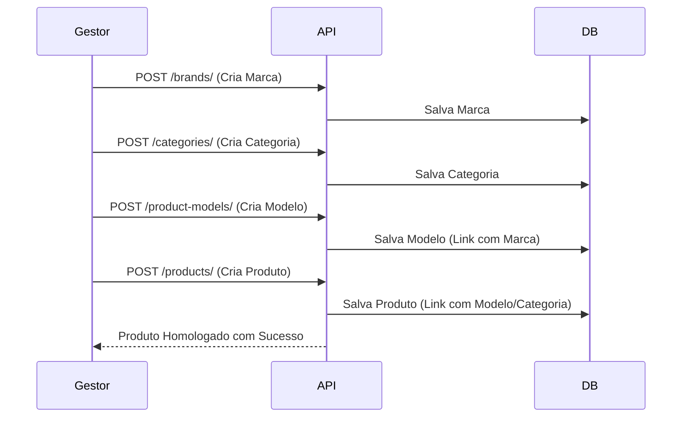
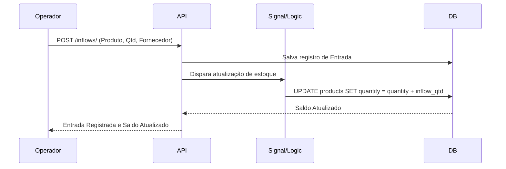
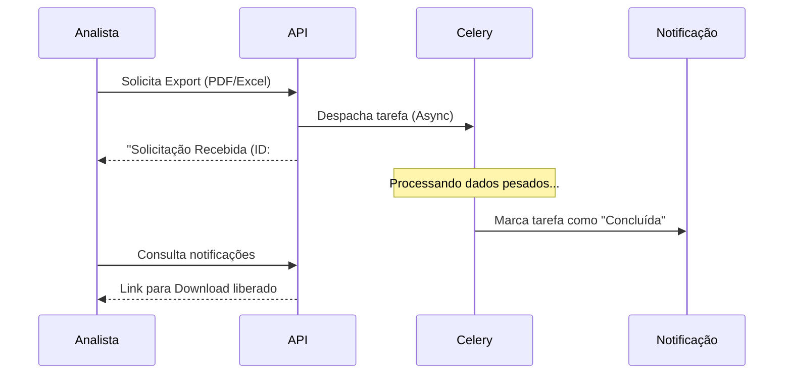
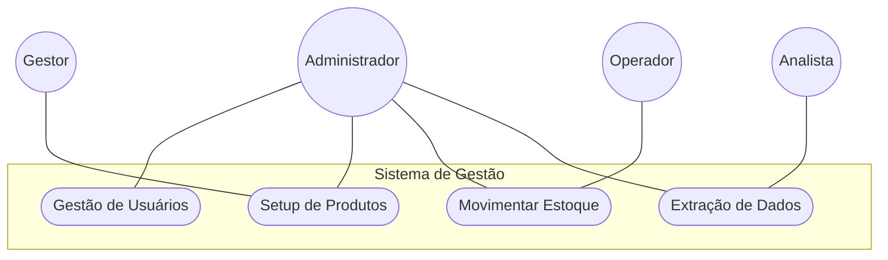

# Casos de Uso

Este documento detalha o fluxo de interação e a lógica de negócio para os principais cenários do sistema.

---

## 🗂️ 1. Homologação de Novo Produto

**Ator**: Gestor de Estoque  
**Resumo**: Processo de introdução de um novo item no catálogo, garantindo que todas as dependências (Marca, Categoria, Modelo) existam corretamente.

---

## 📥 2. Recebimento de Carga (Inflow)

**Ator**: Operador de Logística  
**Resumo**: Registro de entrada de mercadoria fornecida por um parceiro externo, resultando no incremento automático do saldo em estoque.

---

## 📊 3. Auditoria Mensal de Inventário

**Ator**: Analista de Dados  
**Resumo**: Extração de dados para conferência externa. Utiliza processamento assíncrono para lidar com grandes volumes de dados sem impactar a performance.

---

## 📈 Diagrama Geral de Atores

Abaixo está a visão consolidada de acesso por perfil:

